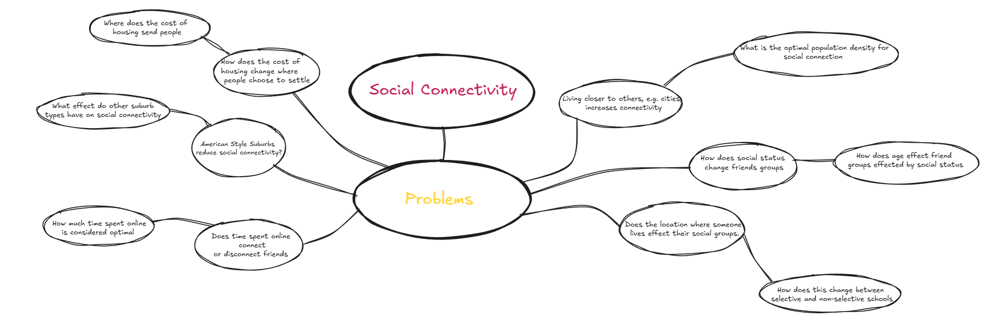

# Assessment Task 3 CP

#### *Charles McDonagh*

### Hypothesis

Single houses are worst for social connectivity then .

### Mind Map

### Requirements Outline

Functional Requirements:

- The ability to load large sets of data and to be modular enough to be able to be moved to take different file types.
- The charts need to be clearly visible even to someone without any experience in the field.
- The user interface needs to be simple to navigate and load without issues.
- There shouldn't be any bugs in the display and processing of data

### Use Case
*Actor:* User
*Goal:* To access and look through the dataset.

Preconditions:
The dataset is already downloaded
The interface is running and active.

Main Flow:

The user opens to see a GUI
User selects one of the following options:
a. View visualisation (e.g., chart or graph of selected data)
b. Search or filter data based on specific criteria

The system performs this action

Postconditions:

User has viewed and/or interacted with the data.

Data remains unchanged despite viewing.

### Data Dictionary 

| Field | Datatype | Format for Display | Description | Example |Valdiation |
| -------- | -------| ------ | ----------- | ------- | --------  |
| Year Group | integer | N | Year group of the respondant | 9 | Will only be 10 or 9 due to the groups where the form was sent
| Region | Object | XX...XX | The location of th respondant | Central Coast | Any number of characters, just no numbers
| Year 7 First Day | Object | XX...XX | Did the respondant know people day 1 year 7 | Yes | Either Yes, No or Maybe 
| Friend Group Size | Integer | N | Size of the respondant's friend group group | 7 | Between 1 and 10 |
|
